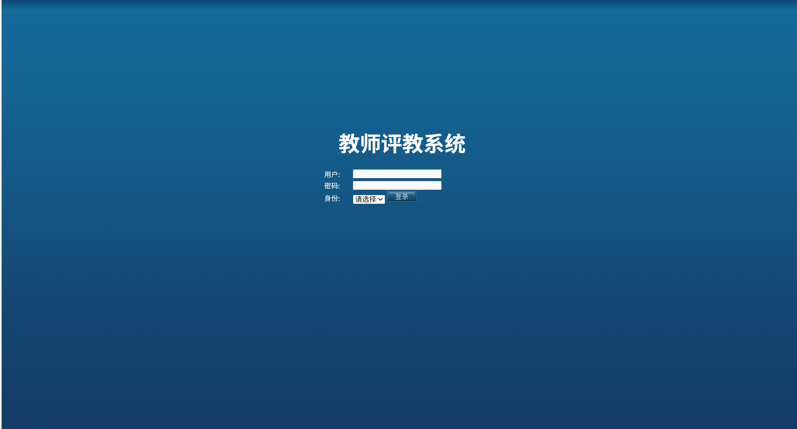
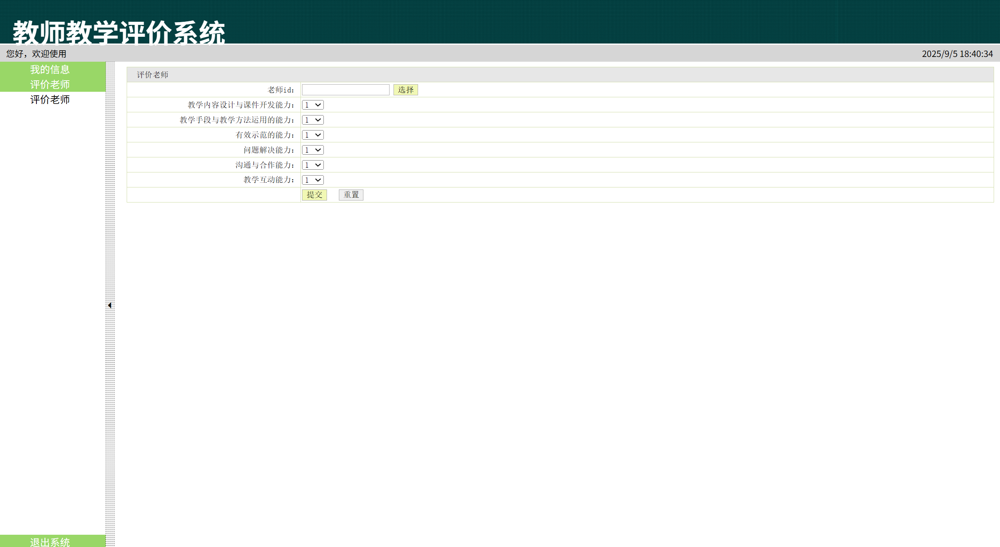
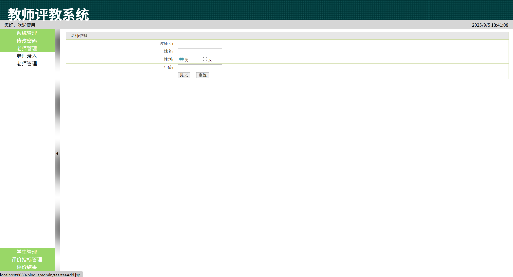
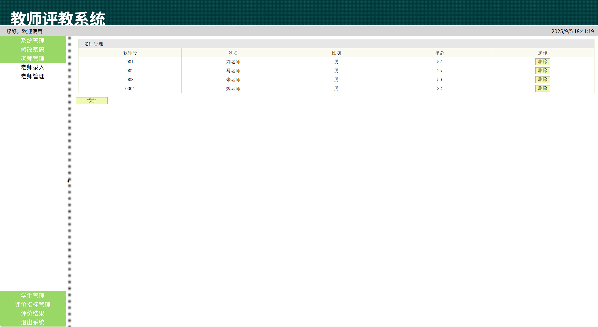
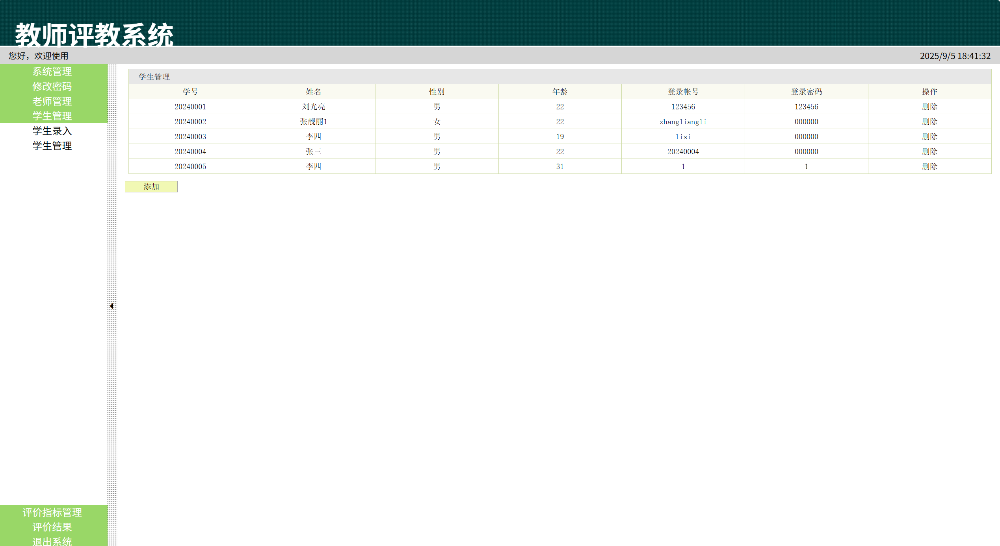
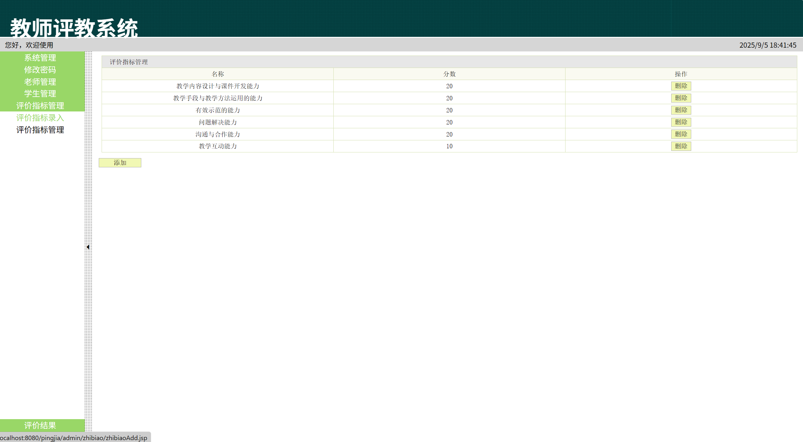
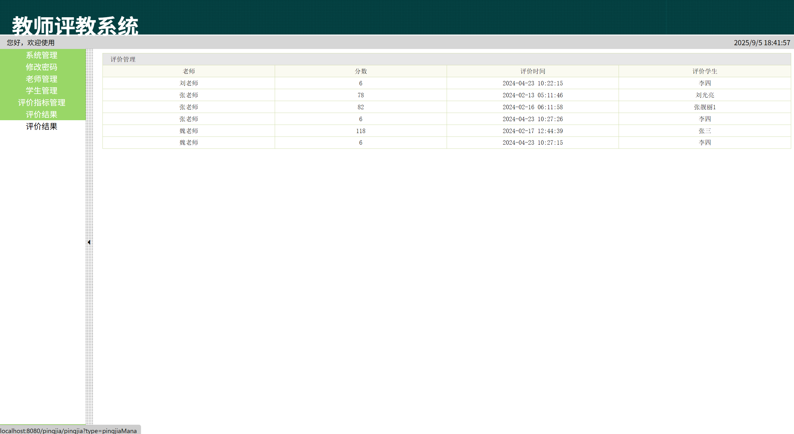
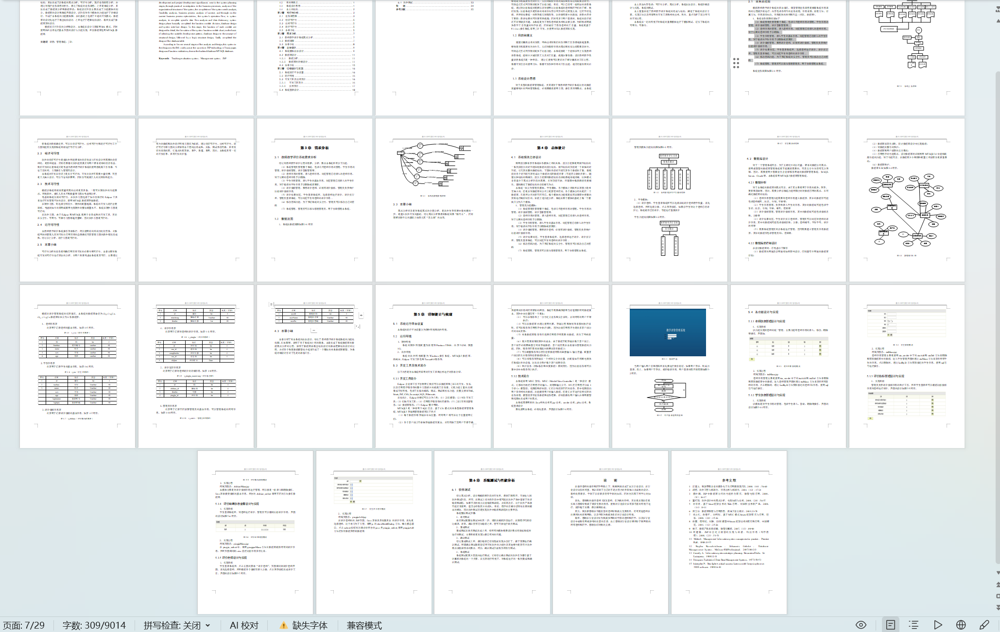

# jspServlet029
jspServlet029教师教学评价系统+BG
 
## 源码问题查看主页咨询

### 一、关键词

教师教学评价系统，教师教学评价管理系统

### 二、作品包含
源码+数据库+设计报告文档+全套环境和工具资源+本地部署教程

### 三、项目技术
前端技术：Html、Css、Js、Jquery、Bootstrap
后端技术：Java、JSP、Servlet、JDBC

### 四、运行环境（以下版本亲测，其他版本兼容性请自行测试）
开发工具：IDEA/eclipse

数据库：MySQL5.7或8.0

服务器：Tomcat8.5或Tomcat9.0

数据库管理工具：Navicat10以上版本

环境配置软件： JDK1.8

浏览器：谷歌浏览器

### 五、项目介绍
项目编号：jspServlet029

随着计算机技术的发展，网络技术对我们的生活和工作显得越来越重要，特别是信息高度发达的今天，人们对最新信息的需求和发布迫切需要及时性。而动态交互式网页刚好提供了这些功能。目前，网上已经有一些类似的评教系统，通过对这些系统的观察以及对使用过这些系统的老师和同学们的了解，我们发现：这些系统只是简单的将评价内容以网页的形式展现出来，让同学们选择，然后将结果统一的保存提交到服务器。这样做有很大的弊端，评教内容难于更新；教评结果的可信度有待提高；同时有多个用户登录时，系统的运行状况不好等诸多问题。本系统是为了教务老师提供相关决策支持，为职称评聘提供教学工作质量的科学依据，同时减轻了教务老师的工作量。

（1）系统管理员管理整个系统，包括公司老师信息的管理、学生信息的管理、评价指标管理、评价查看管理等。
（2）老师信息的管理，录入老师信息，浏览管理已经录入的老师信息，对于过期的老师信息予以删除。
（3）学生信息管理，录入学生的基本信息，浏览管理已经录入的学生信息，对于错误的学生信息予以删除或者更新。
（4）评价指标管理，要想评价老师，必须有评价指标，管理员负责维护这些评价指标信息。 
（5）评价结果浏览，学生登录系统后，选择老师进行评价，评价完毕后，管理员登录系统，可以浏览学生对老师的评价信息 。
（6）修改密码功能，为了保证系统的安全性，管理员可以修改自己的密码 
（7）系统管理，管理员可以添加普通管理员，用于协助管理本系统。

### 六、运行截图

